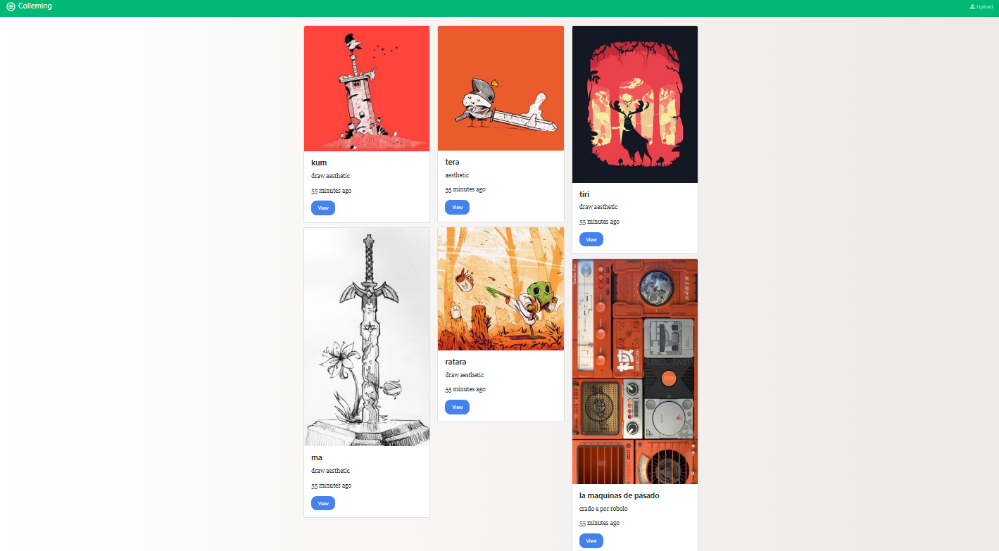

## Proyecto Backend - Página de Publicación de Imágenes Similar a Pinterest

### Explicación del Proyecto

1. **Tecnologías Utilizadas**:
   - Node.js: Un entorno de tiempo de ejecución de JavaScript que permite ejecutar código JavaScript en el servidor.
   - Express: Un framework web de Node.js que simplifica el desarrollo de aplicaciones web.
   - MongoDB: Una base de datos NoSQL que almacena los datos en forma de documentos JSON (BSON).

2. **Funcionamiento**:
   - Usuarios: Los usuarios pueden registrarse e iniciar sesión en la aplicación. Cada usuario tiene su perfil con información personal y una lista de imágenes que ha publicado.
   - Imágenes: Los usuarios pueden publicar imágenes y agregar una descripción a cada una. Las imágenes se almacenan en la base de datos junto con la información del usuario que las publicó.
   - Feed: La página principal muestra un feed con las imágenes más recientes publicadas por todos los usuarios.

3. **Uso por parte de los usuarios**:
   - Los usuarios pueden utilizar la plataforma para compartir sus imágenes y ver las imágenes publicadas por otros usuarios.
   - Es una plataforma para la inspiración y el descubrimiento de nuevas imágenes creativas y atractivas.
   - Los usuarios pueden interactuar con las imágenes, dar "me gusta", comentar y guardar las imágenes en sus colecciones.

### Cómo Iniciar el Proyecto

Para iniciar el proyecto backend, sigue estos pasos:

1. **Configuración Inicial**:
   - Instala Node.js y MongoDB en tu sistema si aún no lo has hecho.
   - Crea una nueva carpeta para tu proyecto y navega a ella en tu terminal.

2. **Inicializa el Proyecto**:
   - Crea un nuevo archivo `package.json` con el siguiente comando:
     ```
     npm init
     ```
   - Instala las dependencias necesarias (Node.js, Express, MongoDB, Mongoose, etc.):
     ```
     npm install express mongoose bcryptjs jsonwebtoken multer fs-extra
     ```
3. **Iniciar el Servidor**:
- Ejecuta el servidor con el siguiente comando:
  ```
  npm run dev
  ```
  el servidor http://localhost:3000/
  4. **Funciones en Proceso de Desarrollo**:
   Este prototipo se encuentra en una etapa temprana de desarrollo, y algunas funciones importantes aún están en proceso de implementación. Algunas de las funciones que faltan incluyen:

   - Interacción con Imágenes: Actualmente, los usuarios solo pueden publicar imágenes, pero aún no se han implementado funciones como "me gusta", comentarios o guardar imágenes en colecciones personales.
   - Perfil del Usuario: Aunque los usuarios pueden registrarse y iniciar sesión, todavía no se ha desarrollado completamente la sección del perfil del usuario con información detallada y opciones de edición.
   - Optimizaciones: A medida que se continúa el desarrollo, se implementarán optimizaciones y mejoras en el rendimiento para manejar un mayor número de usuarios y contenido.
